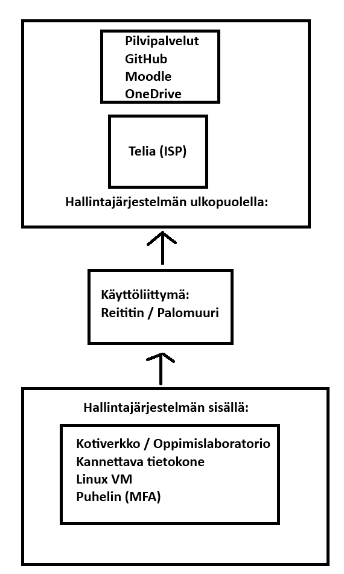
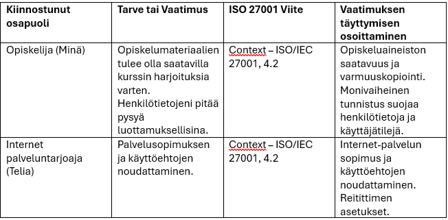

# H1 - Freedom of Action, Control, and Risk Mitigation

## ISMS
Tietoturvallisuuden hallintajärjestelmä (ISMS) on joukko menettelytapoja, käytäntöjä ja resursseja, joiden avulla organisaatio hallitsee tieto-omaisuuttaan ja siihen liittyviä tietoturvariskejä (SFS-EN ISO/IEC 27000:2020, s. 11). Tässä tehtävässä tarkastellaan omaa koti- ja opiskeluympäristöä ISMS:n hallinta-alueena.

## Tehtävät:
## A1) Hallinta-alueeseen kuuluvat asiat
Oman tietoturvallisuuden hallintaan kuuluvat laitteet ovat kannettava tietokone, reititin ja puhelin. Käytän tietokonetta luomaan virtuaalisen Linux-työympäristön ja yhdistämään opiskelun aikana tarvittaviin palveluihin, kuten Github-säiliöön, Moodle-palvelun kurssimateriaaleihin ja Haaga-Helian verkkosivulle. Muodostan yhteyden kotiosoitteestani langallisella lähiverkkotekniikalla. 
Opiskelumateriaalit ovat digitaalisessa muodossa Moodle-palvelussa ja tallennettuna OneDrive-palveluun ja oman tietokoneeni kiintolevylle. Käytän puhelinta monivaiheiseen tunnistautumiseen (MFA), opiskelussa käytettäviin palveluihin.

## A2) Hallinta-alueen ulkopuolelle jäävät asiat
Hallinta-alueen ulkopuolella ovat internet-palvelun tarjoaja (Telia) ja kotiosoitteessani oleva televisio. Telian infrastruktuuri on hallinta-alueen ulkopuolella, koska en omista tai hallitse sitä enkä pysty määrittämään sen tietoturva-asetuksia. Televisioni on ei säilytä mitään henkilökohtaisia tietojani itsestäni ja se ei ole olennainen osa kurssin harjoitteluympäristöä. Televisio on hallinta-alueen ulkopuolella, koska se ei säilytä henkilökohtaisia tietojani eikä ole olennainen osa kurssin harjoitteluympäristöä.

## A3) Rajapinnat ja käyttöliittymät
Rajapinta muodostuu kotiverkon ja internetissä olevien palveluiden välille. Käyttöliittymänä toimii reititin ja palomuuri, jotka mahdollistavat yhteydenpidon muihin organisaatioihin. Muodostan yhteyksiä esimerkiksi GitHubiin, Moodleen ja OneDrive palveluihin. Kotiverkkoni on riippuvainen Telian tarjoamasta internet-yhteydestä sekä opiskelussa käytettävistä ulkopuolisista palveluista. 

## Todistusaineistona hallintajärjestelmästä:
A1) – Laiteinventaario sekä valokuvat kannettavasta tietokoneesta, reitittimestä ja puhelimesta. Kuvankaappaukset Moodle-, OneDrive- ja GitHub-palveluista.

A2) – Kuvankaappaus reitittimen asetuksista sekä internet-palvelun sopimus, josta käy ilmi palveluntarjoaja.

A3) – Reitittimen asetukset, joista näkyy kotiverkon ja internetin välinen rajapinta.

## Verkkokaavio

## B) Taulukko

## Lähteet:
SFS. 2020. SFS-EN ISO/IEC 27000:2020: Information technology. Security techniques. Information security management systems. Overview and vocabulary (ISO/IEC 27000:2018). Helsinki: Suomen Standardisoimisliitto SFS ry. Luettu: 25.08.2026.

SFS. 2023. SFS-EN ISO/IEC 27001:2023: Tietoturvallisuus, kyberturvallisuus ja tietosuoja. Tietoturvallisuuden hallintajärjestelmät. Vaatimukset. Helsinki: Suomen Standardisoimisliitto SFS ry. Luetty 25.08.2026.

