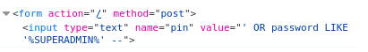
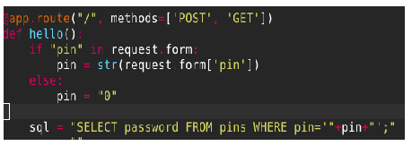
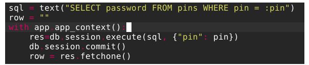
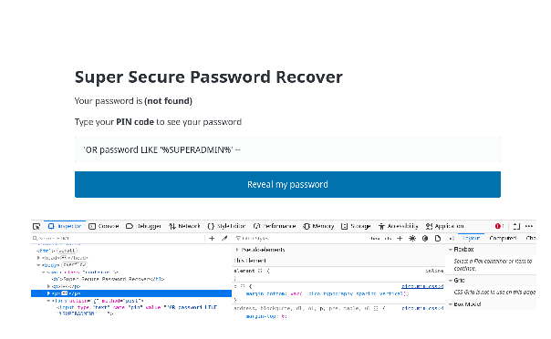
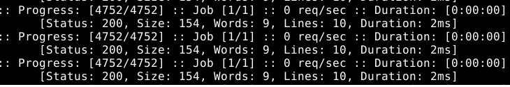
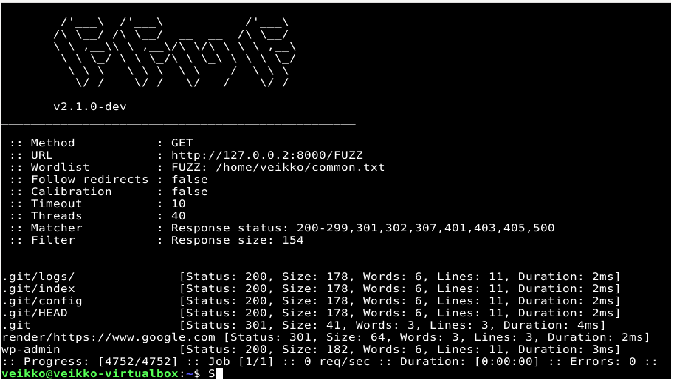

# H2 Break & Unbreak

## X)
## A01 Broken Access Control OWASP Top 10:
Puutteellinen pääsynvalvonta (Broken Access Control) on yleisin turvallisuusriski verkkosovelluksissa.  Haavoittuvuudet antavat käyttäjille pääsyn katsoa ja muuttaa tietoa. Haavoittuvuutta voi estää siirtämällä kulunvalvonnan verkkopalvelimen puolelle, jotta ohjelmisto voi tarkistaa käyttäjän oikeudet liittyen tietopyyntöihin.

## Find Hidden Web Directories – Fuzz URLS with ffuf  (Karvinen 2023):
Artikkeli kertoo Fuff-nimisestä ohjelmasta, jolla voi löytää hakemistoja, jotka eivät ole näkyvissä käyttäjälle. Termi ”fuzzing” on ohjelmistokehityksessä automatisoitu testausmenetelmä, joka syöttää tietokoneohjelmalle odottamatonta tietoa. Ohjelma käyttää sanakirjaa, joka sisältää yleisiä hakemistojen nimiä. 

## Access control vulnerabilities and privilege escalation (PortSwigger):
Artikkeli kertoo pääsynvalvonnan eskalaation kolmesta mekanismista ja niiden esimerkeistä. 

Pystysuuntaisen pääsynvalvonnan on tarkoitus rajoittaa käyttäjän pääsyä ohjelmiston toimintoihin käyttäjän roolin mukaan. Eskalaatio voi tapahtua, jos sovellus säilyttää arkaluontoista materiaalia verkkosivun polussa, jonka kautta käyttäjä saa pääsyn hänelle kuulumattomille toiminnoille. Käyttäjä voi löytää suojaamattoman toiminnallisuuden esimerkiksi yllä mainitun Fuff-ohjelmiston kautta. 

Vaakasuuntainen pääsynvalvonta rajoittaa käyttäjän pääsyä resursseihin, jotka kuuluvat samaan ryhmään.  Eskalaatio voi tapahtua esimerkiksi suojaamattomien objektiviittausten kautta (IDOR). Objektit voivat olla esimerkiksi verkkotunnuksen kyselyparametrejä: 

https://esimerkki.com/tili?parametri=arvo.

Kontekstisidonnainen pääsynvalvonta rajoittaa käyttäjän pääsyä resursseihin ja toimintoihin sovelluksen tilaan perustuen. Eskalaatio voi tapahtua, jos käyttäjä voi ohittaa sovelluksen normaalin toimintajärjestyksen. Käyttäjä voisi esimerkiksi ostaa tuotteen verkkokaupasta tekemättä maksutoimenpidettä.

## Report Writing (Karvinen 2006):
Artikkeli kertoo onnistuneen raportin ominaisuuksista, jotka ovat toistettavuus, täsmällisyys, helppolukuisuus ja viittaukset lähteisiin. Täsmällinen ja toistettava raportti sisältää yksityiskohtia harjoituksen aikana suoritetuista komennoista ja laitteistosta. Harjoitustehtävien välivaiheet merkitään ja teksti jäsennellään luettavuuden parantamiseksi. 

## Harjoituksen ympäristö:
Käyttöjärjestelmä: Linux-VM Debian - Debian jakelu versio 13.4.0 amd64-xfce

Verkkoselain: Firefox

Verkkoyhteys: NAT

Ohjelmisto: ffuf versio 2.1.0 (Verkkotunnuksien hakemistojen etsintä)

## A) Break into 010-staff-only
Tehtävän tavoite on löytää admin salasana. Kokeilin aluksi vain syöttää satunnaisia numeroita syötekenttään, mutta noin minuutin jälkeen lopetin arvailun ja sirryin kokeilemaan SQL-injektiota.
Sivuston alta näkee SQL-lausekkeen:

SELECT password FROM pins WHERE pin

Pins on taulukko, joka sisältää kaksi arvoa – password ja pin. Tehtävässä lukee myös, että haluttu admin salasana sisältää merkkijonon ”SUPERADMIN”, joten kokeilin SQL-kielen LIKE operaattorin käyttöä. Katsoin ohjeita SQL-injektioon PortSwigger sivuston artikkelista. Avasin Firefox-selaimen Web developer tools valikon ja etsin syötekentän, johon pin koodi kirjoitetaan. Vaihdoin Input type muuttujan merkkijonoksi, jotta haku onnistuisi.

Heittomerkki aloittaa uuden SQL-lausekkeen, jolla voi injektoida oman hakupyynnön. LIKE operaattori etsii merkkijonoja, jotka sisältävät SUPERADMIN merkkijonon.
Vastauksena tuli:

SUPERADMIN%%rootALL-FLAG{Tero-e45f8764675e4463db969473b6d0fcdd}

## B) Fix the 010-staff-only vulnerability from source code
Lähdekoodissa pin arvo on liitetty suoraan SQL-kyselyyn. Tämä mahdollistaa SQL-komennon lisäämisen syötteen aikana. 

Korjauksena vaihdetaan sql arvon pin muuttuja merkkijonoksi, joka toimii paikkamerkkinä käyttäjän syöttämälle arvolle. 

Tämän jälkeen SQL-injektio ei tuota enää salasanaa. 

## C) Solve dirfuzt-1
Tehtävässä etsittiin kohde verkkosivuston dirfuzt-1 hakemistoja Admin page ja version control page. Työkaluna toimi ohjelmisto ffuf, joka etsii hakemistot käyttäen komentoa:

ffuf -w common.txt -u http://127.0.0.2:8000/FUZZ

ffuf ohjelmisto käyttää sanakirjaa, joka löytyy common.txt tiedostosta löytääkseen verkkotunnuksen hakemistoja. Komento tulosti seuraavanlaista dataa:

Hakutuloksia oli noin 90 kappaletta joista suurin osa näytti olevan 154 tavua. Suodatin pois 154 tavun kokoiset hakemistot komennolla ffuf -w common.txt -u http://127.0.0.2:8000/FUZZ -fs 154. Tuloksena tuli seuraava:

Kokeilemalla hakemistoja  http://127.0.0.2:8000/.git ja  http://127.0.0.2:8000/wp-admin jotka antoivat liput:

.git - FLAG{tero-git-3cc87212bcd411686a3b9e547d47fc51}

wp-admin - FLAG{tero-wpadmin-3364c855a2ac87341fc7bcbda955b580}

## D) Break into 020-your-eyes-only
Kokeilin aluksi suoraan ffuf ohjelman käyttöä komennolla ffuf -w common.txt -u http://127.0.0.2:8000/FUZZ. Tämä tuotti yhden tuloksen:

admin-console [Status: 301, Size: 0, Words: 1, Lines: 1, Duration 2ms]

Kokeilin ladata sivun uudelleen http://127.0.0.2:8000/admin-console syötteellä, mutta se ohjasi minut takaisin http://127.0.0.2:8000/accounts/login/?next=/admin-console/ sivulle. Ohjattu sivu vaatii sisäänkirjautumisen, joten kokeilin uudestaan rekisteröimällä käyttäjän sivulle. Syötin saman syötteen uudelleen, joka tuotti lipun:

Hakemistojen etsintä manuaalisesti syöttämällä tunnuksia osoitteiden perään olisi hyvin hidasta. 

## Lähteet
Lähteet:

Karvinen, T. 2006. Raportin kirjoittaminen. Luettu 1.9.2026. https://terokarvinen.com/2006/raportin-kirjoittaminen-4/

Karvinen, T. 2024. Hack'n Fix. Luetty 1.9.2026. https://terokarvinen.com/hack-n-fix/

OWASP. 2021.A01:2021 – Broken Access Control. OWASP Top 10:2021. Luettu 01.9.2026. https://owasp.org/Top10/2021/A01_2021-Broken_Access_Control/index.html

PortSwigger. 2026. Access control vulnerabilities and privilege escalation. Web Security Academy. Luettu 1.9.2026. https://portswigger.net/web-security/access-control

PortSwigger. 2026. SQL injection. Luettu 1.9.2026. https://portswigger.net/web-security/sql-injection

Wikipedia. Fuzzing. Luettu 1.9.2026. https://en.wikipedia.org/wiki/Fuzzing

