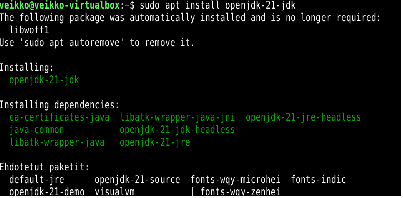

# H4 Some disassembly required

## X)

Videossa käytettiin Ghidra-sovellusta tiedostojen takaisinmallintamiseen. Ghidra sovellus näyttää tiedoston konekielenä. Konekielen voi muuntaa funktioiksi ohjelman työkaluilla ja tiedostosta voi löytää myös merkkijonoja.

## A)

Tehtävä aloitettiin asentamalla Ghidra-sovellus. Sovellus tarvitsee openjdk-21 ympäristön toimiakseen. Asensin ensin java-ympäristön komennolla sudo apt install openjdk-21-jdk

Tämän jälkeen latasin Ghidra sovelluksen Github-repositiriosta, jonka suorittamiseen käytin komentoa ./ghidraRun

## B)

Aloitin analysoimalla packd tiedostoa. Käytin Ghidran-analyysi komentoa, joka tuotti funktiot tiedostosta. Löysin funktion processEntry, joka on oletettavasti ohjelman aloitus. Katsoin aluksi ohjelmasta löytyviä merkkijonoja, josta löysin mahdollisen lipun FLAG{Tero-0e3bed0a89d8851da933c64fefad}. 
