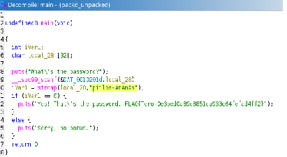
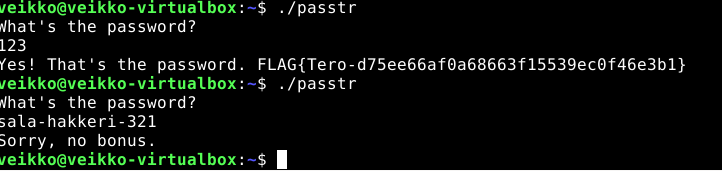
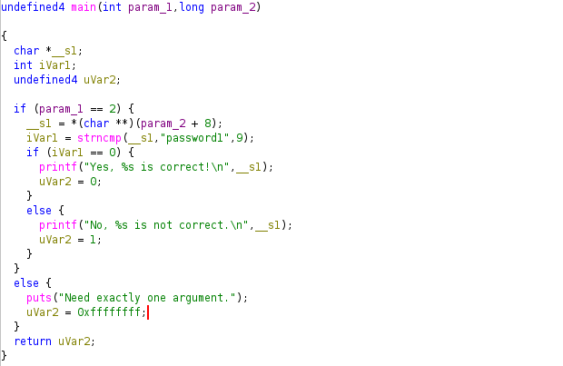
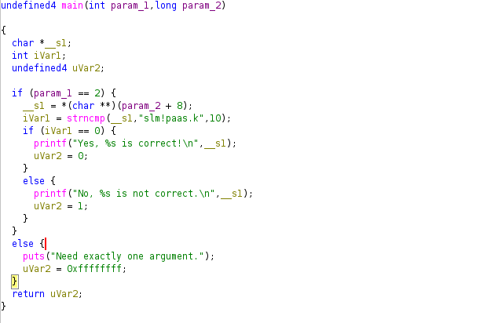

# H4 Some disassembly required

## X)

Videossa käytettiin Ghidra-sovellusta tiedostojen takaisinmallintamiseen. Ghidra sovellus näyttää tiedoston konekielenä. Konekielen voi muuntaa funktioiksi ohjelman työkaluilla ja tiedostosta voi löytää myös merkkijonoja.

## A)

Tehtävä aloitettiin asentamalla Ghidra-sovellus. Sovellus tarvitsee openjdk-21 ympäristön toimiakseen. Asensin ensin java-ympäristön komennolla sudo apt install openjdk-21-jdk

Tämän jälkeen latasin Ghidra sovelluksen Github-repositiriosta, jonka suorittamiseen käytin komentoa ./ghidraRun

## B)

Aloitin analysoimalla packd tiedostoa. Käytin Ghidran-analyysi komentoa, joka tuotti funktiot tiedostosta. Löysin funktion processEntry, joka on oletettavasti ohjelman aloitus. Katsoin aluksi ohjelmasta löytyviä merkkijonoja, josta löysin, että ohjelma on pakattu UPX ohjelmalla. "$Info: This file is packed with the UPDX executable packer". Latasin upx-ohjelman ja purin tiedoston komennolla upx -d -o packd_unpacked packd. Liitin puretun tiedoston Ghidra-sovellukseen josta löytyi main-entry point.

Funktiosta näkee strcmp funktion joka vertaa paikallista muuttujaa local_28 merkkijono bufferia merkkijonoon "piilos-AnAnAs". Jos iVarl on arvoltaan nolla, antaa se lipun FLAG{Tero-03bed0a89d8851da933c64fefad4ff2}.

## C)

Tarkistin aluksi main funktiota, josta löysin oikean salasanan "sala-hakkeri-321". Konekoodi vertaa TEST EAX, EAX rekisteriä ja antaa lipun, jos rekisteri ei ole nolla. Vaihdetaan JNZ JZ operandiin ja saadaan oikea tulos.

## D)

Funktiossa verrataan paikallista muuttujaa _sl merkkijonoon password1. Kokeillaan syötettä password1 ja se antaa oikean tuloksen "Yes, password1 is correct!".

Funktiossa verrataan paikallista muuttujaa _sl merkkijonoon "slm!paas.k". Kokeillaan syötettä "slm!paas.k" ja se antaa oikean tuloksen "Yes, slm!paas.k is correct!".

## Lähteet

https://github.com/NoraCodes/crackmes

https://terokarvinen.com/application-hacking/#laksyt

https://www.youtube.com/watch?v=oTD_ki86c9I

