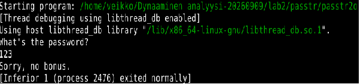
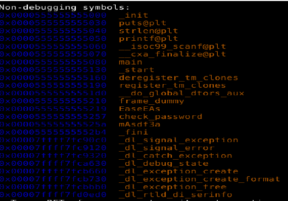
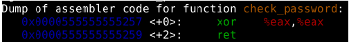
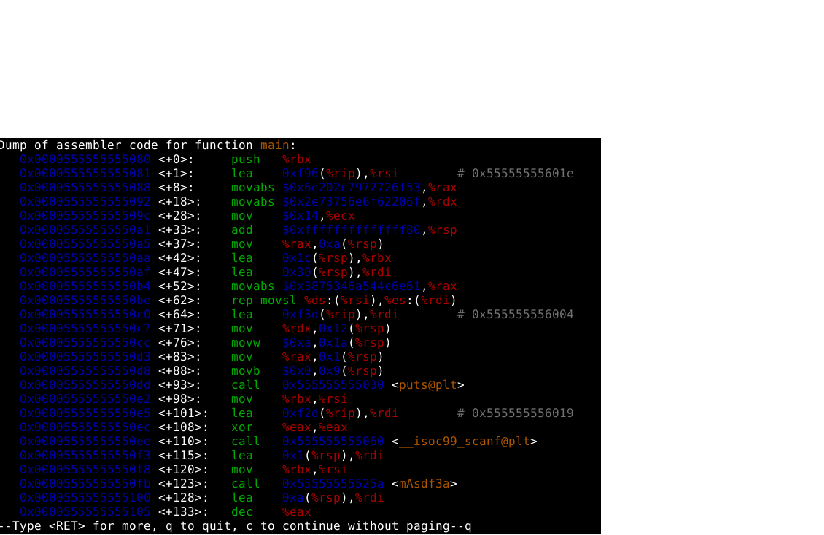
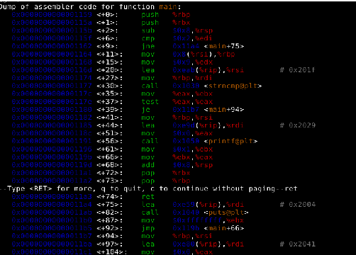

# H5 Binääri tässä, missä koodit?

## LAB 2
Aloitin ohjelman tarkistuksen käynnistämällä GDB-debugger ohjelman konsolisyötteestä komennolla "gdb passtr2o". Merkkijono "passtr2o" on tiedoston nimi ja "gdb" on debugger-ohjelma. 
Ensimmäiseksi kokeilin vain ajaa ohjelman kerran nähdäkseni mahdolliset tulosteet konsoliin ja käyttäjältä kysyttävät tiedot. Komento "run" aloittaa ohjelman.

Tulosteesta näkee merkkijonon "What's the password?", joka on todennäköisesti tulostettu printf funktiolla. Katsoinkin ohjelmassa käytettyjä funktioita komennolla "info functions".

Heksadesimaalinen luku näyttää funktion muistiosoitteen ja nimi on siitä oikealla. Tulosteesta näkeekin "printf@plt" funktion ja toisenkin mielenkiintoisen funktion nimeltä "check_password". Lähdin tarkastelemaan funktion "check_password" disassembler koodia komennolla "disassemble check_password".

Se näyttää vain asettavan eax-rekisterin arvon nollaksi ja funktio päättyy siihen. Tässä ei näytä olevan mitään tarkistusvaihetta, sillä olettaisin näkevän koodeja cmp ja test, jos arvoja vertaillaan. Tarkistin main-funktion disassemble näkymää, joka tuotti seuraavan kuvan:

Kutsu call 0x555555555060 osoitteesen on mielenkiintoinen, koska kutsuttu funktio on scanf. Funktio lukee siis käyttäjän syötettä, joka oli minun tapauksessani 123. Tämän jälkeen tulee myös funktio mAsdf3a, jonka nimen perusteella ei voi sanoa mitään, mutta se tapahtuu syötteen lukemisen jälkeen, joten katson sen disassemble näkymää komennolla "disassemble mAsdf3a". Laitoin pysäytyskohdan osoitteeseen 0x55555555527c, jossa verrataan rekistereitä r12d ja edx. Oma syötteeni oli merkkijono test, jossa on neljä kirjainta ja se myös vastaa rekisterin arvoa edx. Rekisterin r12d arvo on taas 8 ja jos arvot eivät ole samoja, funktio palaa takaisin. Käynnistin ohjelman uudelleen merkkijonolla testtest, jossa on kahdeksan merkkiä, jotta vertailu onnistuisi. 

Katsoin rekisterien merkkijonon arvoja komennolla xs $rbp ja xs $rbx. Rbp rekisteri sisälsi arvon anLTj4u8 ja rbx rekisterissä oli oma arvoni testtest. Merkkijono anLTj4u8 näytti hyvälle, joten kokeilin sitä salasanaksi, mutta en saanut lippua. Katsoin funktiossa olevaa silmukkaa ja huomasin, että parittomista merkkijonon indekseistä vähennetään seitsemän ja parillisiin lisätään luku kolme. Nämä ovat op-koodit:

sub 0x7 edx
add 0x3 edx

Tämä antaakin anLTj4u8 merkkijonolle arvon dgOMm-x1, joka antoi lipun FLAG{Lari-rsvRDx04WMBZpuwg4qfYwzdcvVa0oym}.

## LAB 3
Kokeilin crackme01 haastetta. Ohjelma vaati argumentin, joten käynnistin gdb-debuggerin ja syötin komennon "set args testi". Merkkijono "testi" toimii main-funktion argumenttina. Luin rekisterin RSI arvon ennen kutsua strncmp funktioon, jotta näkisin verrattavan merkkijonon. Komennolla x/s $rsi tuotti tuloksen "password1". Syötin password1 merkkijonon set args komennolla ja vastauksena tuli "Yes, password1 is correct!". 

## Lähteet

https://visualgdb.com/gdbreference/commands/
