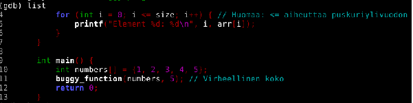

# H5 Binääri tässä, missä koodit?

## LAB 0
Aloitin ohjelman tarkistuksen käynnistämällä GDB-debugger ohjelman konsolisyötteestä komennolla "gdb buggy_program". Merkit "buggy_program" on tarkastettavan ohjelman tiedostonimi. 

Tulostin ohjelman lähdekoodin konsolisyötteeseen komennolla "list", joka tuotti seuraavan kuvan:

