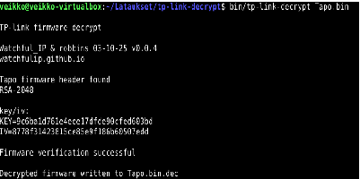
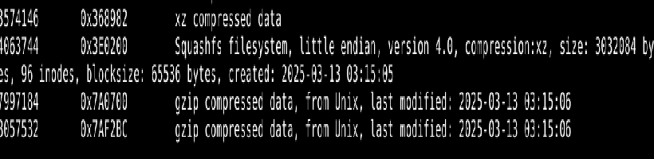

# h6 Onkohan tämä turvallinen käyttää?

## Ympäristö

-Käyttöjärjestelmä: Linux-VM Debian - Debian jakelu versio 13.4.0 amd64-xfce

## 1 - Decrypt the firmware image
Kameran laiteohjelmiston binäärin suojaus purettiin tp-link-decrypt komennolla. Komento tuottaa toisen tiedoston .dec tiedostopäätteellä. 

## 2 Analyse image
Tämän jälkeen katsoin laiteohjelmiston binääria binwalk työkalulla. Komento binwalk -eM Tapo.bin.dec etsii binääriin upotettuja kuvia ja suoritettavaa ohjelmistoa. Komento löysi tiedostojärjestelmän nimeltä Squashfs. 

Ohjelma purki tiedostot squashfs-root kansioon. Katsoin käytetyt ohjelmistot komennolla find . -type f -executable -ls. Esiin nousi main, gdbserver, impdbg, hostapd ja iperf. Komennolla readelf -h bin/main, sain tiedoston käyttöjärjestelmän (UNIX - System V), Mikroprosessori (MIPS R3000)

## Lähteet

https://github.com/robbins/tp-link-decrypt
